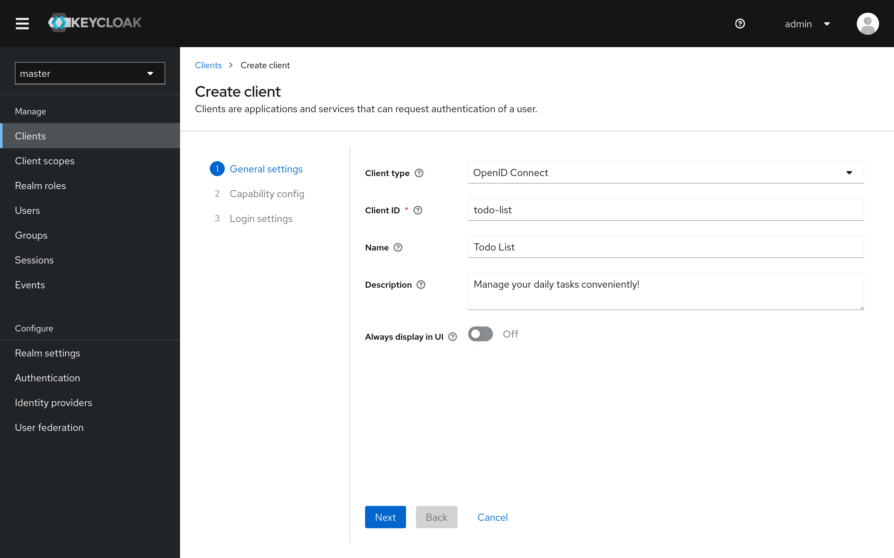

# Keycloak Demo

This project is meant to demonstrate how Keycloak can be integrated to provide authentication to a Web-based application, and how to build REST APIs that are protected.

## Prerequisites

Install Node.js using the installation instructions from [their website](https://nodejs.org/en/download), or use a version manager such as [Node Version Manager](https://github.com/nvm-sh/nvm). Once Node.js has been installed run the following command to install the dependencies of the project:

```sh
npm install
```

In order to run the Keycloak server the Java Development Kit (JDK) version 17 will have to be installed, find a distribution on the Web (Temurin is recommended), or use a version manager such as [SDKMAN!](https://sdkman.io/).

## Running the application

Run the following command to start the application:

```sh
npm run start
```

This script will start several services that are needed to run everything together:

- The client application — http://localhost:8080
- The REST API — http://localhost:3000 (also proxies through  http://localhost:8080/api for convenience)
- The Keycloak server ([nightly version](https://github.com/keycloak/keycloak/releases/tag/nightly)) — http://localhost:8180

> **Note**
> This script caches the installation of the Keycloak server in the `server` directory. Removing this directory will re-download the latest version the next time this script is ran.

### Creating a client

In order for the client application to be able to authenticate on the Keycloak server a client will have to be created in Keycloak's administration console. Open the administration console by navigating to the Keycloak server, then click the 'Clients' section and add a new client, changing the following configuration:

- Client ID — `todo-list`
- Name (optional) — `Todo List`
- Description (optional) — `Manage your daily tasks conveniently!`




Press the 'Next' button, and leave the configuration on the page to the default values. Press the 'Next' button again to continue to the 'Login Settings' page.

On this page set the following values:

- Valid redirect URIs — `http://localhost:8080/*`
- Web origins — `+`


Now press 'Save' to create the new client.

## Creating roles for the client

Press the 'Roles' tab on the client details page, then press the 'Create role' button. From there create the following roles:

- `view-todos` — Allows a user to view todos.
- `create-todos` — Allows a user to create todos.
- `update-todos` — Allows a user to update todos.
- `delete-todos` — Allows a user to delete todos.
